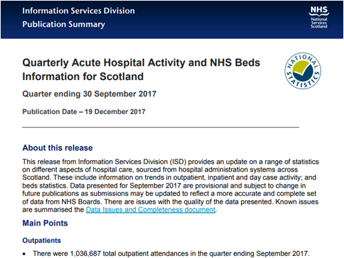
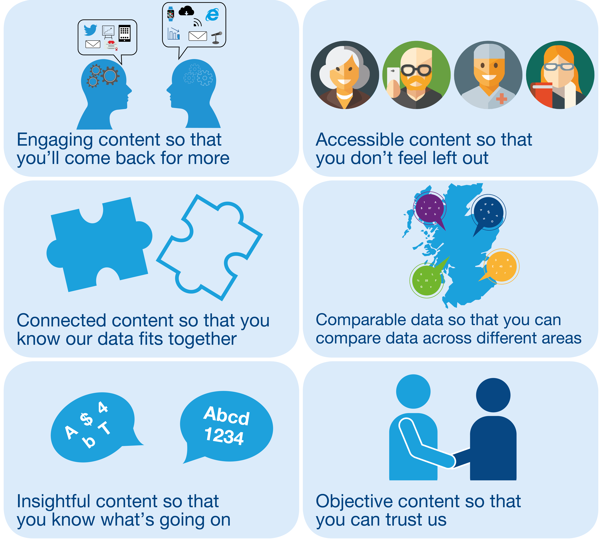

```{r setup, include = FALSE}
library(knitr)
knitr::opts_chunk$set(echo = FALSE)
```

## Background

- The Information Services Division (ISD) of the National Health Service (NHS) Scotland has a long history of producing official and national statistics. 
- We produce around 200 publications each year.
- Traditional publication format is a **static pdf document** with accompanying **excel tables**.
- Production uses **proprietary software** and is **time-consuming**, involving extensive manual formatting and checking.

```{r out.width = "40%", fig.align = 'center'}

```

## Vision

```{r out.width = "75%", fig.align = 'center'}

```

## Initial User Engagement

- Focus groups and interviews with over 10 different user groups.
- Determined user experiences of existing product and how the new product design could meet their needs.
- Created user stories which influenced the features of the minimum viable product.

```{r out.width = "90%", fig.align = 'center'}
include_graphics("images/user engagement.png")
```

## Minimum Viable Product (MVP)

- [Acute Hospital Activity and Beds publication](http://www.isdscotland.org/Health-Topics/Hospital-Care/Publications/2018-06-26/Acute-Hospital-Publication/) released in December 2017.

```{r out.width = "75%", fig.align = 'center'}
include_graphics("images/acute activity.png")
```

## MVP: Data explorer

```{r out.width = "85%", fig.align = 'center'}
include_graphics("images/data explorer.png")
```
[Acute Activity data explorer](https://www.isdscotland.org/Health-Topics/Hospital-Care/Publications/2018-06-26/Acute-Hospital-Publication/data-explorer/)
<br>
<br>[R Shiny code](https://github.com/Health-SocialCare-Scotland/Hospital-Acute-Activity/tree/master/Data-Explorer)

## User Feedback

```{r out.width = "85%", fig.align = 'center'}
include_graphics("images/quotes.png")
```

## User Testing

- To determine how the explorer **works in practice**, and to identify potential **faults or usability issues**.
- In general, feedback indicates that the core functionality of the explorer is **highly usable**.
- Features to improve usability include:
    - Features that distract or confuse users removed from the `plotly` toolbar
    - `plotly` toolbar displays by default
    - Default graph automatically displays

## The Challenge of Scaling

- R knowledge within ISD:
    - R training at an organisation level
    - [R Style Guide](https://github.com/Health-SocialCare-Scotland/R-Resources/blob/master/PHI%20R%20style%20guide.md)
    - Blank [R Project](https://github.com/Health-SocialCare-Scotland/r-project-structure) and [R Shiny](https://github.com/Health-SocialCare-Scotland/rshiny-project-structure) templates
    - [Resources](https://github.com/NHS-NSS-transforming-publications/resources)
- Consistency of Shiny dashboards:
    - Share [R Shiny code](https://github.com/Health-SocialCare-Scotland/Hospital-Acute-Activity/tree/master/Data-Explorer) for the original data explorer
    - Future: design manual
- IT 
    - shiny.io server and iframes
    - R and RStudio versions
    - package management

## Next Steps

- **Psychiatric Hospital Activity publication** to be released 25 September 2018.
- Continued **refinement** of the current Data explorer.
- **Accessibility** review of the Data explorer.
- Automate production process ([Reproducible Analytical Pipeline](https://ukgovdatascience.github.io/rap_companion/)).

```{r out.width = "60%", fig.align = 'center'}
include_graphics("images/rap.png")
```

## Thank You {.smaller}
<div class="columns-2">
<ul>
```{r out.width = "40%"}

```
<br>
```{r out.width = "12%"}
include_graphics("images/twitter.png")
```
@price_AH
<br>
```{r out.width = "12%", }
include_graphics("images/github.png")
```
annahprice
</ul>
<ul>
```{r out.width = "40%"}

```
<br>
```{r out.width = "12%"}
include_graphics("images/twitter.png")
```
@Tyjet92
<br>
```{r out.width = "12%"}
include_graphics("images/github.png")
```
davidc92
</ul>
</div>

```{r out.width = "60%", fig.align='center'}

```

Acute Activity publication: https://bit.ly/2PhLYbL

Contact Transforming Publishing: nss.isdtransformingpublishing@nhs.net

Transforming Publishing on GitHub: <br> https://github.com/NHS-NSS-transforming-publications

ISD on GitHub: https://github.com/Health-SocialCare-Scotland


